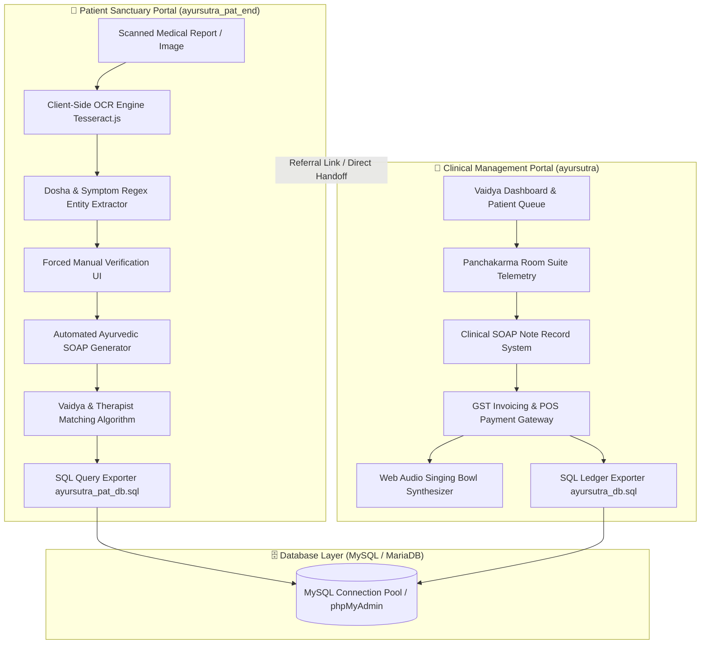
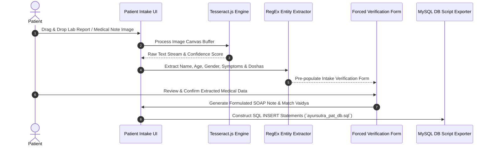
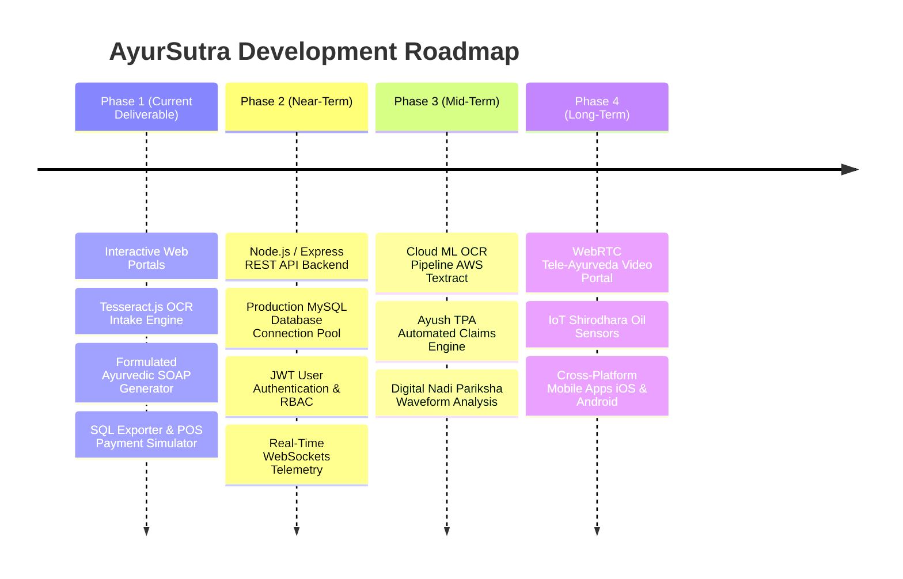

<div align="center">

# 🌿 AyurSutra — Classical Vedic Health Tech & Clinical Sanctuary Platform

### *Bridging Panchakarma Wisdom with Modern Digital Health Infrastructure*

[](https://github.com/2025ucp1468-Mayank/SIH_PROJECT)
[](https://github.com/2025ucp1468-Mayank/SIH_PROJECT/tree/mayank)
[](https://github.com/2025ucp1468-Mayank/SIH_PROJECT)
[](LICENSE)

[**Explore Hospital Portal**](file:///c:/Users/Mayan/New%20folder%20%282%29/SIH_PROJECT/SIH_PROJECT/ayursutra/index.html) • [**Explore Patient Intake Portal**](file:///c:/Users/Mayan/New%20folder%20%282%29/SIH_PROJECT/SIH_PROJECT/ayursutra_pat_end/index.html) • [**System Architecture**](#-system-architecture) • [**Quick Start**](#-quick-start-guide)

---

</div>

## 📌 Executive Summary & Project Vision

**AyurSutra** is an end-to-end Ayurvedic Clinical Management, Panchakarma Sanctuary, and Intelligent Patient Intake platform built for the **Smart India Hackathon (SIH) 2026**.

The platform digitizes classical Vedic healthcare operations—combining **Nadi Pariksha diagnostics**, **Panchakarma room telemetry**, **AI-assisted medical report OCR parsing**, **automated Ayurvedic SOAP clinical note generation**, **dynamic Vaidya/therapist matching algorithms**, and **GST-compliant POS hospital billing ledgers**.

> [!IMPORTANT]
> **SIH 2026 Evaluation Notice:** This repository contains the complete frontend web applications (`ayursutra` and `ayursutra_pat_end`), client-side OCR engine integrations, Web Audio soundscape synthesizers, and complete ready-to-import MySQL database schemas (`ayursutra_db.sql` & `ayursutra_pat_db.sql`).

---

## 🌟 Key Application Portals

### 1. 🏥 `ayursutra` — Clinical & Hospital Management Portal
Designed for Acharyas, Vaidyas, receptionists, and hospital administrators.
- **Panchakarma Sanctuary Suite Telemetry:** Live tracking of therapy rooms (*Shirodhara*, *Abhyanga*, *Basti*, *Nasya*, *Swedana*), oil temperatures, and session countdown timers.
- **Vaidya SOAP Clinical Notes:** Structured intake for *Pradhana Karma*, *Paschat Karma*, *Prakriti Dosha* evaluation (*Vata*, *Pitta*, *Kapha*), and herbal formulations (*Kashayam*, *Choornam*, *Arishtam*).
- **POS Hospital Billing & GST Invoicing:** Live ledger calculator, Ayush TPA insurance claim verification, multi-channel payment simulator (RuPay/VISA, UPI, Net Banking), and singing bowl Web Audio soundscape feedback.
- **3D Atmospheric Visualizer:** Built with Three.js for serene, immersive healing ambience in clinical suites.

### 2. 🌸 `ayursutra_pat_end` — Patient Sanctuary & Intake Portal
Designed for patients to complete self-intake before or during hospital visits.
- **Optical Character Recognition (OCR) Engine:** Built on `Tesseract.js` to parse scanned lab reports, MRIs, and clinical notes into structured medical entities.
- **Dosha & Symptom Extractor:** Automatically calculates Dosha dominance percentages (*Vata %*, *Pitta %*, *Kapha %*) based on diagnostic text.
- **Forced Manual Data Verification:** High-precision human-in-the-loop review interface ensuring 100% data integrity before database persistence.
- **Automated Ayurvedic SOAP Note Generator:** Constructs clinical Subjective, Objective, Assessment, and Plan notes instantly from extracted patient data.
- **Smart Therapist Matcher:** Algorithmic matching of patients to specialized Vaidyas based on Dosha imbalance and chief complaints.
- **Live Credit/Debit Card Visualizer:** Interactive card UI with real-time formatting, security mask, and instant authorization feedback.

---

## 🏗️ System Architecture



---

## 🔬 OCR Intake & NLP Pipeline Architecture



---

## 🗄️ Database Persistence & SQL Schema Architecture

The platform includes two comprehensive SQL schema scripts optimized for **MySQL 5.7+ / MariaDB 10.2+ (XAMPP phpMyAdmin compatible)**:

| Schema File | Core Purpose | Key Relational Tables Included |
| :--- | :--- | :--- |
| [`ayursutra/ayursutra_db.sql`](file:///c:/Users/Mayan/New%20folder%20%282%29/SIH_PROJECT/SIH_PROJECT/ayursutra/ayursutra_db.sql) | Clinical & Hospital Management | `patients`, `therapists_doctors`, `therapy_sessions`, `prescriptions`, `invoices`, `payments` |
| [`ayursutra_pat_end/ayursutra_pat_db.sql`](file:///c:/Users/Mayan/New%20folder%20%282%29/SIH_PROJECT/SIH_PROJECT/ayursutra_pat_end/ayursutra_pat_db.sql) | Patient Intake & Telemetry | `patient_portal_uploads`, `soap_notes`, `therapist_matches`, `intake_telemetry` |

### Core Database Tables:

```sql
-- Patients Table Structure Excerpt
CREATE TABLE IF NOT EXISTS patients (
    patient_id INT AUTO_INCREMENT PRIMARY KEY,
    patient_code VARCHAR(20) UNIQUE NOT NULL,
    full_name VARCHAR(100) NOT NULL,
    age INT NOT NULL,
    gender ENUM('Male', 'Female', 'Other') NOT NULL,
    blood_group VARCHAR(5),
    prakriti_dosha VARCHAR(50),
    vata_percentage DECIMAL(5,2),
    pitta_percentage DECIMAL(5,2),
    kapha_percentage DECIMAL(5,2),
    created_at TIMESTAMP DEFAULT CURRENT_TIMESTAMP
);
```

---

## 🛠️ Technology Stack & Dependencies

| Category | Technologies / Libraries | Description |
| :--- | :--- | :--- |
| **Core Frontend** | HTML5, Modern JavaScript (ES Modules) | Lightweight, fast single-page client architecture |
| **Styling & Design** | Tailwind CSS CDN, Custom Vanilla CSS | Glassmorphism, serene dark & light themes, Google Fonts (*Cinzel*, *Plus Jakarta Sans*) |
| **Icons & Visuals** | Lucide Icons, Three.js | Modern icon set and 3D web canvas rendering |
| **OCR Engine** | Tesseract.js v5 | Client-side Optical Character Recognition for diagnostic images |
| **Audio Synthesizer** | Web Audio API | Real-time Tibetan singing bowl chime synthesis for serene UX |
| **Server Environment** | Node.js (Built-in `http` server) | Zero-dependency static server supporting clean routing |
| **Database** | MySQL / MariaDB (XAMPP compatible) | 12 structured relational tables with automated SQL generation |

---

## 🚀 Quick Start Guide

### Prerequisites
- [Node.js](https://nodejs.org/) (v18+ recommended) **OR** [Python 3.x](https://www.python.org/)

### 1. Clone the Repository
```bash
git clone https://github.com/2025ucp1468-Mayank/SIH_PROJECT.git
cd SIH_PROJECT
git checkout mayank
```

### 2. Launch the Application Server
Run the built-in Node server script:
```bash
node server.js
```
*Alternatively using Python:*
```bash
python -m http.server 3000
```

### 3. Open in Browser
- **Patient Sanctuary Intake Portal:** `http://localhost:3000/ayursutra_pat_end/`
- **Clinical Hospital Portal:** `http://localhost:3000/ayursutra/`

### 4. Database Setup (Optional for XAMPP / MySQL)
1. Launch phpMyAdmin (`http://localhost/phpmyadmin`).
2. Create database `ayursutra_db`.
3. Import [`ayursutra/ayursutra_db.sql`](file:///c:/Users/Mayan/New%20folder%20%282%29/SIH_PROJECT/SIH_PROJECT/ayursutra/ayursutra_db.sql).
4. Import [`ayursutra_pat_end/ayursutra_pat_db.sql`](file:///c:/Users/Mayan/New%20folder%20%282%29/SIH_PROJECT/SIH_PROJECT/ayursutra_pat_end/ayursutra_pat_db.sql).

---

## 🗺️ Multi-Phase Development Roadmap



---

## 📊 Technical Disclosure & Known Constraints

> [!NOTE]
> Detailed technical disclosure for SIH jury evaluation and audit:

| Dimension | Current Implementation | Mitigation / Production Roadmap |
| :--- | :--- | :--- |
| **OCR Extraction** | Client-side Tesseract.js parsing with regular expressions. | **Forced Manual Verification UI:** Allows patient/Vaidya to correct low-confidence text prior to submission. Roadmap includes AWS Textract for handwritten clinical notes. |
| **Audio Policies** | Web Audio API soundscape chimes. | Implemented explicit user interaction handlers (`btn-audio-toggle`) to satisfy browser autoplay security policies. |
| **Persistence** | Instant client-side state + exportable executable SQL files. | Node.js REST API with ORM (Prisma/Sequelize) to sync directly to live MySQL connection pools. |
| **POS Payments** | Interactive live RuPay/VISA card visualizer & UPI simulator. | Webhook integration with Razorpay / PhonePe payment gateways for live settlements. |

---

## 📁 Repository Structure

```
SIH_PROJECT/
├── README.md                     # Comprehensive Repository Documentation
├── project.md                    # Detailed Technical Disclosure & Engineering Report
├── server.js                     # Static Node.js HTTP Server for local execution
├── SIH_ppt_final.pptx            # Smart India Hackathon Presentation Deck
├── ayursutra/                    # Clinical & Hospital Management Portal
│   ├── index.html                # Main Clinical Portal HTML Interface
│   ├── app.js                    # Hospital System Controller & State Engine
│   ├── ayur-intro.js             # Interactive Introductory Flow Controller
│   ├── three-bg.js               # Three.js Serene 3D Background Renderer
│   ├── audio.js                  # Web Audio Tibetan Singing Bowl Synthesizer
│   ├── data.js                   # Clinical Datasets (Vaidyas, Therapies, Rooms)
│   ├── styles.css                # Custom CSS Design System & Layout Engine
│   └── ayursutra_db.sql          # MySQL Clinical Schema & Sample Data
└── ayursutra_pat_end/            # Patient Sanctuary & Medical Intake Portal
    ├── index.html                # Patient Intake & Verification Interface
    ├── app.js                    # Patient Portal Controller & OCR Pipeline
    ├── data.js                   # Therapist Datasets & Matching Logic
    ├── styles.css                # Custom Glassmorphic Dark-Mode Styles
    └── ayursutra_pat_db.sql      # MySQL Patient Telemetry & SOAP Schema
```

---

## 📜 License & Compliance Notice

This project is developed for the **Smart India Hackathon (SIH) 2026** under the repository branch [`mayank`](https://github.com/2025ucp1468-Mayank/SIH_PROJECT/tree/mayank). All rights reserved by the project authors.

---

<div align="center">

**Developed with 🌿 for AyurSutra — Smart India Hackathon 2026**

</div>
