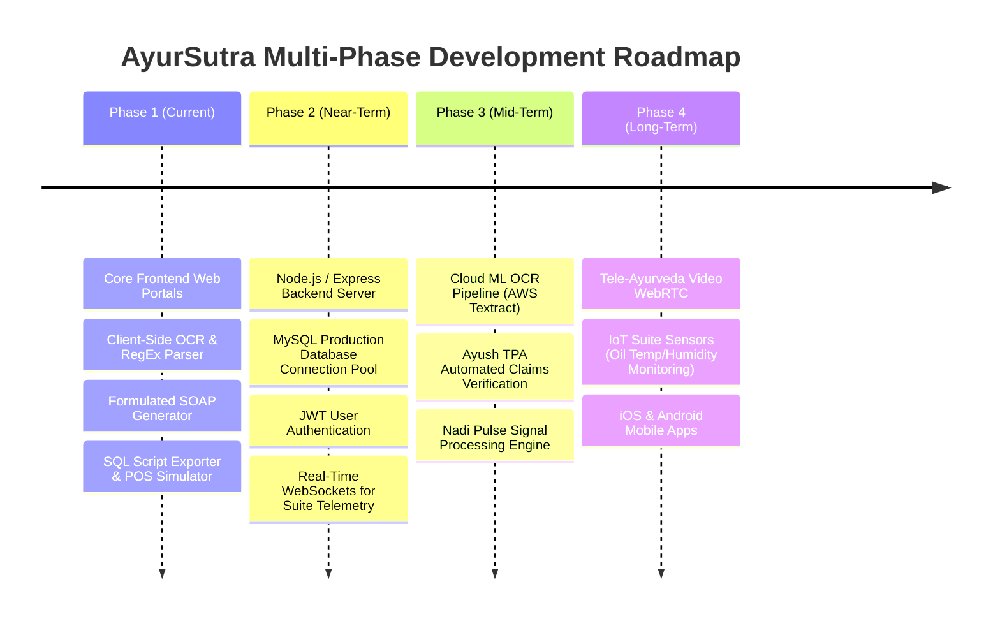

# AyurSutra — Technical Documentation, System Architecture & Project Disclosure

> **SIH (Smart India Hackathon) Project Specification & Engineering Report**
> **Repository Branch:** `mayank`
> **Primary Systems:** `ayursutra` (Clinical & Hospital Management Portal) & `ayursutra_pat_end` (Patient End Medical Intake & Matching Portal)

---

## 1. System Overview & Technical Disclosure

AyurSutra is an end-to-end Ayurvedic Clinical Management, Panchakarma Sanctuary, and Patient Intake platform designed to digitize classical Vedic healthcare workflows, Nadi Pariksha diagnostics, clinical SOAP notes, patient intake via OCR, and hospital billing ledgers.

### Status Delineation (Implemented vs Future Scope)
To ensure complete technical transparency for evaluation and audit:
- **Implemented (Current Deliverables):** Interactive single-page web application architecture, client-side OCR parsing engine, forced manual data verification forms, Ayurvedic SOAP clinical note generator, dynamic therapist matching algorithms, POS payment gateway simulators, interactive live credit card previewers, and MySQL SQL query script exporters (`ayursutra_db.sql` & `ayursutra_pat_db.sql`).
- **Simulated / Client-Side Prototypes:** Payment gateway processing steps, Tesseract.js client-side OCR fallback parsing, and in-memory state persistence.
- **Backend Infrastructure Needed for Production:** Server-side API endpoints (Node.js/Express or Python/FastAPI), live database drivers (MySQL/MariaDB Connection Pool), and production payment gateway webhooks (Razorpay / PhonePe).

---

## 2. Optical Character Recognition (OCR) Architecture

### Current Implementation
- **Client-Side Engine:** Uses `Tesseract.js` via CDN combined with a regular expression parser (`parseExtractedOCRText`) in `ayursutra_pat_end/app.js`.
- **Extraction Targets:** Automatically parses patient demographics (Name, Age, Gender, Blood Group, Phone), chief complaints/symptoms, and Prakriti Dosha percentages (Vata %, Pitta %, Kapha %).
- **Preset Demonstration Reports:** Includes preset diagnostic reports (Migraine / Vata-Pitta, Chronic Sinusitis / Kapha, Sciatica / Vata) for instant demonstration without external file dependencies.

### Production OCR Architecture (Target Roadmap)
```
[Scanned Patient Report / Image]
              │
              ▼
[REST API: POST /api/v1/ocr/process]
              │
              ▼
[Cloud OCR Pipeline: AWS Textract / Google Cloud Vision API]
              │
              ▼
[Ayurvedic Entity Extractor (NLP Regex + BioBERT Model)]
              │
              ▼
[JSON Payload -> Forced Manual Verification UI]
```

---

## 3. Database Persistence & SQL Schema

### Database Architecture (`ayursutra_db.sql` & `ayursutra_pat_db.sql`)
The backend database is structured for **MySQL 5.7+ / MariaDB 10.2+ (XAMPP phpMyAdmin compatibility)** consisting of 12 relational tables and 3 telemetry views:

| Table Name | Primary Purpose | Key Fields |
| :--- | :--- | :--- |
| `patients` | Clinical patient profile & Dosha ratio | `patient_code`, `prakriti_dosha`, `vata_percentage`, `pitta_percentage`, `kapha_percentage`, `admission_status` |
| `therapists_doctors` | Acharyas, Vaidyas & Doctor profiles | `doctor_code`, `specialization`, `consultation_fee`, `rating`, `clinic_id` |
| `therapy_sessions` | Panchakarma execution tracking | `session_code`, `therapy_name`, `karma_phase`, `oil_temp_celsius`, `status` |
| `prescriptions` | Formulations, Pathya & Apathya | `prescription_code`, `ayurvedic_diagnosis`, `herbal_formulations`, `pathya_diet`, `apathya_restrictions` |
| `invoices` | GST-compliant hospital billing | `invoice_code`, `subtotal`, `gst_amount`, `discount_amount`, `total_amount`, `status` |
| `payments` | POS gateway transaction log | `payment_code`, `payment_method`, `gateway_provider`, `transaction_reference`, `payment_status` |
| `patient_portal_uploads` | Patient intake OCR logs | `upload_code`, `raw_ocr_text`, `ocr_confidence_score`, `uploaded_at` |
| `soap_notes` | Structured clinical SOAP notes | `soap_code`, `subjective_notes`, `objective_notes`, `assessment_notes`, `plan_notes` |

### SQL Exporter Mechanism
When a patient completes intake or an admin creates an invoice, `app.js` programmatically constructs executable SQL `INSERT` statements ready for direct execution in XAMPP phpMyAdmin or MySQL CLI.

---

## 4. Payment Gateway Integration Details

### Current Implementation (Simulated Gateway)
- **Supported Payment Channels:**
  1. **UPI / QR**: Instant QR payment simulation (GPay, PhonePe, Paytm).
  2. **RuPay / VISA Cards**: Features a **Live Animated Credit/Debit Card Visualizer** that updates card number formatting (`4532 •••• •••• 8821`), expiry, and cardholder name in real-time.
  3. **Ayush TPA Insurance Claims**: Cashless claim pre-authorization handling for Ayush health policies.
  4. **Net Banking**: Direct bank account debit (SBI, HDFC, ICICI).
  5. **Cash at Desk**: POS counter cash receipt recording.
- **Audio Feedback:** Uses Web Audio API (`playSingingBowlChime`) for sound effects upon payment completion.

### Production Payment Integration Roadmap
```
[Client Checkout UI] ──(Select Method)──> [Server: POST /api/v1/payments/create-order]
                                                     │
                                                     ▼
[Razorpay / PhonePe Payment Gateway API] <──(SDK Init)──┘
             │
             ├──(Success Webhook)──> [Database: UPDATE invoices SET status='Paid']
             └──(Callback UI)─────> [Client: Render GST Tax Invoice & Download PDF]
```

---

## 5. Backend API Specifications (Target Specs)

The frontend is prepared for integration with the following RESTful API schema:

```typescript
// Patient Intake API
POST /api/v1/patients/intake
Header: Content-Type: application/json
Request Body: {
  fullName: string,
  age: number,
  gender: 'Male' | 'Female' | 'Other',
  bloodGroup: string,
  contactPhone: string,
  symptoms: string,
  medicalHistory: string,
  ocrRawText?: string
}
Response (201 Created): {
  patientId: string,
  patientCode: string,
  status: 'Registered'
}

// Therapist Matching API
GET /api/v1/therapists/match?dosha=Vata&symptoms=migraine
Response (200 OK): {
  matchedTherapists: Array<{
    id: string,
    name: string,
    specialization: string,
    matchScore: number,
    consultationFee: number,
    availableSlot: string
  }>
}

// Billing & Payments API
POST /api/v1/payments/authorize
Request Body: {
  invoiceId: string,
  paymentMethod: 'UPI' | 'Card' | 'NetBanking' | 'Insurance_TPA' | 'Cash',
  amount: number
}
Response (200 OK): {
  transactionId: string,
  status: 'Success',
  paidAt: string
}
```

---

## 6. Multi-Phase Project Roadmap



### Detailed Phase Breakdown:
- **Phase 1 (Current Release):**
  - Clinical POS & Panchakarma Sanctuary Management (`ayursutra`).
  - Patient End Portal with OCR, Forced Manual Entry Verification, SOAP Notes Generator, and Therapist Matching (`ayursutra_pat_end`).
  - Viewport Scroll Snap & Light-Mode White Box UI.
  - Exportable MySQL database schema (`ayursutra_db.sql` & `ayursutra_pat_db.sql`).

- **Phase 2 (Backend & Live DB Persistence):**
  - Build Node.js / Express REST API backend.
  - Replace in-memory state with live MySQL connection pool using Sequelize / Prisma ORM.
  - Implement role-based access control (RBAC) for Acharyas, Vaidyas, Receptionists, and Patients.

- **Phase 3 (AI/ML Diagnostics & TPA Automation):**
  - Integrate cloud-native OCR (AWS Textract / Google Vision API) for handwritten prescription parsing.
  - Automated Ayush insurance TPA claims verification portal.
  - Nadi Pariksha digital waveform analysis integration.

- **Phase 4 (Hardware IoT & Tele-Ayurveda):**
  - Tele-Ayurveda video consultation via WebRTC.
  - IoT sensor integration for automated temperature and flow monitoring in Shirodhara chikitsa suites.

---

## 7. Known Issues, Technical Constraints & Edge Cases

| Area | Known Issue / Constraint | Mitigating Strategy / Workaround |
| :--- | :--- | :--- |
| **OCR Image Quality** | Low-resolution or poorly lit mobile photos of handwritten notes may yield low OCR confidence score (<70%). | **Forced Manual Verification Form:** Forces the patient/Vaidya to review and edit extracted text before saving. |
| **Browser Audio Policies** | Autoplay restrictions in modern browsers may mute Web Audio API soundscape chimes until user interaction occurs. | Audio toggle buttons feature explicit user gesture handlers (`btn-audio-toggle`). |
| **PowerShell Execution** | Windows PowerShell security policies may block `npx.ps1` script execution in certain terminal environments. | Executed dev server via Python (`python -m http.server 8080`) or Node direct invocation. |
| **Offline Execution** | Tesseract CDN worker initialization requires internet access unless local worker scripts are bundled. | Fallback regex report parser (`generateMockOCRText`) automatically triggers if CDN worker is unreachable. |

---

## 8. Repository Structure & Execution Instructions

### Local Development Setup
1. **Clone Repository:**
   ```bash
   git clone https://github.com/2025ucp1468-Mayank/SIH_PROJECT.git
   cd SIH_PROJECT
   git checkout mayank
   ```

2. **Run Patient End Portal (`ayursutra_pat_end`):**
   ```bash
   cd ayursutra_pat_end
   python -m http.server 8080
   ```
   Open `http://localhost:8080/index.html` in your browser.

3. **Run Clinical Management Dashboard (`ayursutra`):**
   ```bash
   cd ayursutra
   python -m http.server 8081
   ```
   Open `http://localhost:8081/index.html` in your browser.

4. **Import Database Schema to MySQL / XAMPP phpMyAdmin:**
   - Open phpMyAdmin (`http://localhost/phpmyadmin`).
   - Create database `ayursutra_db`.
   - Import `ayursutra/ayursutra_db.sql`.
   - Import `ayursutra_pat_end/ayursutra_pat_db.sql`.

---

> **SIH Project Compliance Notice:** All code, schemas, and UI components are authored under branch `mayank` for SIH 2026 evaluation.